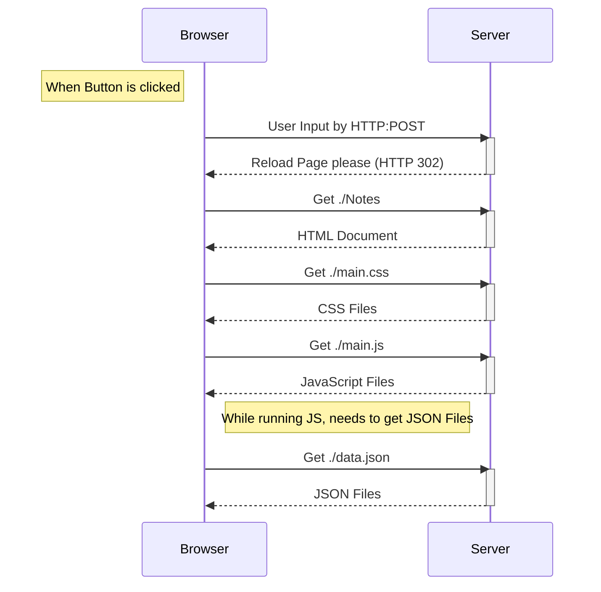

```mermaid
sequenceDiagram
    
    participant Browser
    participant Server
    
    Note left of Browser:When Button is clicked
    Browser->>Server: User Input by HTTP:POST 
    activate Server
    Server-->>Browser: Reload Page please (HTTP 302)
    deactivate Server

    Browser->>Server: Get ./Notes 
    activate Server
    Server-->>Browser: HTML Document
    deactivate Server

    Browser->>Server: Get ./main.css 
    activate Server
    Server-->>Browser: CSS Files
    deactivate Server

    Browser->>Server: Get ./main.js
    activate Server
    Server-->>Browser: JavaScript Files
    deactivate Server

    Note right of Browser: While running JS, needs to get JSON Files
    Browser->>Server: Get ./data.json
    activate Server
    Server-->>Browser: JSON Files
    deactivate Server
```